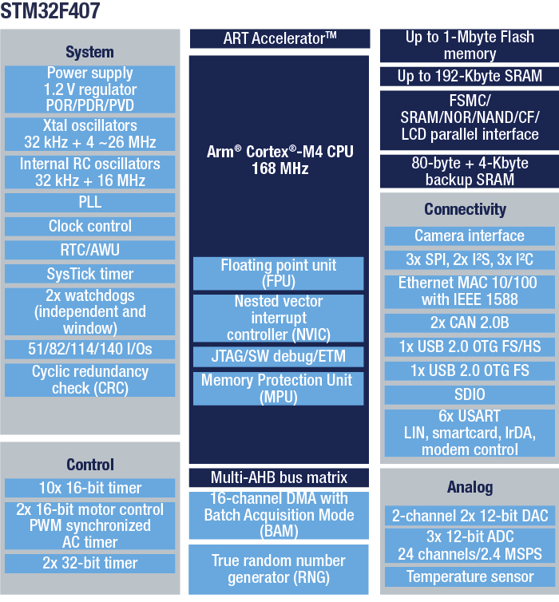

# [STM32F407](https://github.com/SoCXin/STM32F407)

* [ST](https://www.st.com/zh/): [Cortex-M4](https://github.com/SoCXin/Cortex)
* [L3R4](https://github.com/SoCXin/Level): 168 MHz x 1.25 DMIPS/MHz (566CoreMark)

## [简介](https://github.com/SoCXin/STM32F407/wiki)

[STM32F407](https://github.com/SoCXin/STM32F407)该系列产品采用意法半导体90 nm工艺和ART加速器，具有动态功耗调整功能，能够在运行模式下和从Flash存储器执行时实现低至238 µA/MHz的电流消耗（@ 168 MHz）。

### 关键特性

* 15个通信接口
* 2 x USB OTG

#### 封装规格

* LQFP100 (14×14mm)
* LQFP144 (20×20mm)
* LQFP176 (10×10mm)

### [资源收录](https://github.com/SoCXin)

* [参考资源](src/)
* [参考文档](docs/)
* [参考工程](project/)

### [选型建议](https://github.com/SoCXin)

[STM32F407](https://github.com/SoCXin/STM32F407)

### [探索芯世界 www.SoC.xin](http://www.SoC.Xin)
