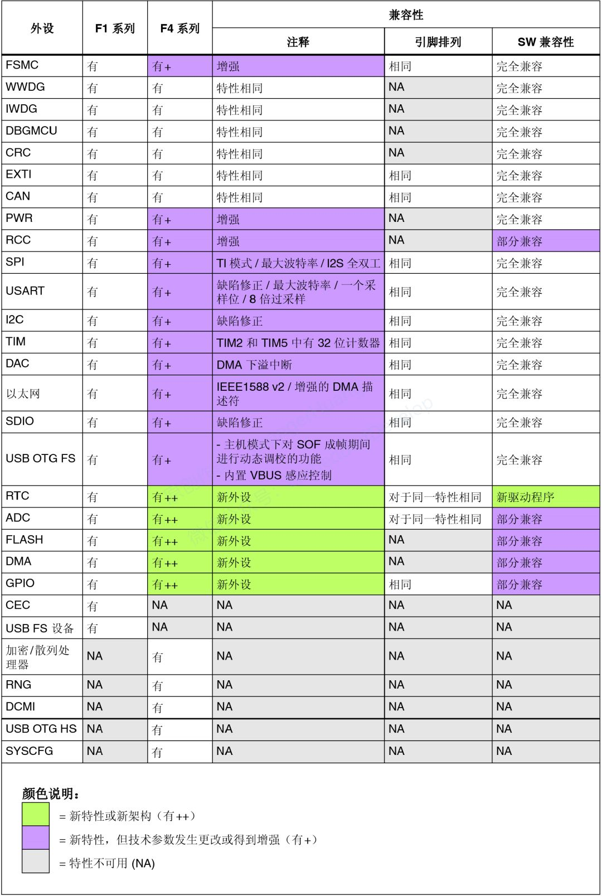
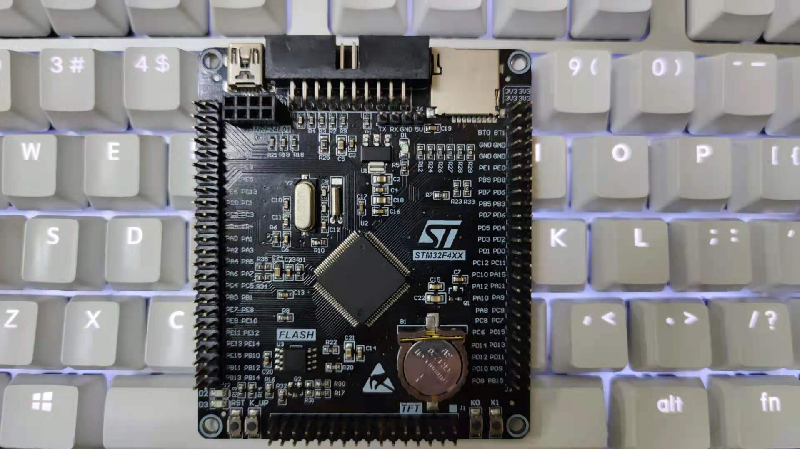

# [STM32F407](https://github.com/SoCXin/STM32F407)

* [ST](https://www.st.com/zh/): [Cortex-M4](https://github.com/SoCXin/Cortex)
* [L5R5](https://github.com/SoCXin/Level): 168 MHz (210DMIPS,566CoreMark)

## [简介](https://github.com/SoCXin/STM32F407/wiki)

### 关键特性

* 以太网 MAC10/100
* 2 x USB OTG (其中一个支持HS)
* 15个通信接口(6个速度11.25 Mb/s的USART、3个45 Mb/s的SPI、3个I²C、2个CAN、SDIO)
* 2xDAC 12bit,  3 x ADC / 24ch x 12bit 2.4MSPS(交错模式7.2MSPS)
* 17个定时器

### [资源收录](https://github.com/SoCXin)

* [参考资源](src/)
* [参考文档](docs/)
* [参考工程](project/)
* [入门教程](https://docs.soc.xin/STM32F407)

### [选型建议](https://github.com/SoCXin)

[STM32F407](https://github.com/SoCXin/STM32F407)是[STM32F4系列](https://www.st.com/zh/microcontrollers-microprocessors/stm32f4-series.html)系列中的老将，在很多场合被提及和应用，可媲美[STM32F103](https://github.com/SoCXin/STM32F103)，拥有大量开源拥趸。

与[STM32F407](https://github.com/SoCXin/STM32F407)拥有相似配置的[STM32F207](https://github.com/SoCXin/STM32F207)在参数规格上有下降，资源丰富度也不及前者，就性价比而言需要综合市场因素进行评估。

#### 封装规格

* LQFP100 (14×14mm)
* LQFP144 (20×20mm)
* LQFP176 (10×10mm)

[STM32F4系列](https://www.st.com/zh/microcontrollers-microprocessors/stm32f4-series.html)与[STM32F1系列](https://www.st.com/zh/microcontrollers-microprocessors/stm32f1-series.html)外设兼容性：

### 开发板资源

#### 高完成度开源项目

* [Arduino_Core_STM32](https://github.com/stm32duino/Arduino_Core_STM32)
* [STM32CubeF4](https://github.com/STMicroelectronics/STM32CubeF4)

### [探索芯世界 www.SoC.xin](http://www.SoC.Xin)
