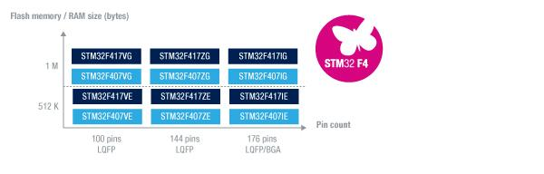
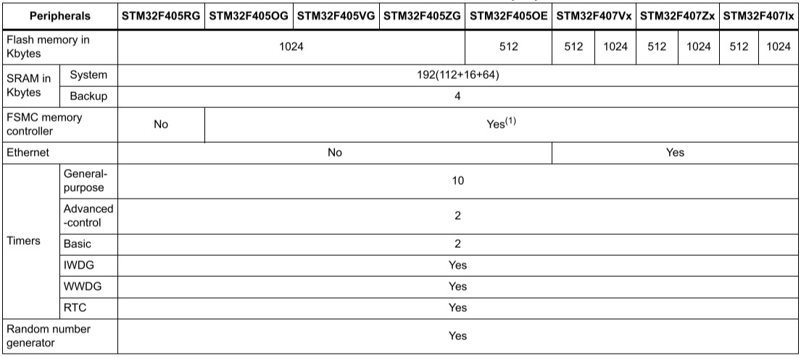

# [STM32F407](https://github.com/sochub/STM32F407) 
 
#### 父级：[STM32F4](https://github.com/sochub/STM32F4)
#### 架构：[Cortex M4](https://github.com/sochub/CM4) 
#### 收录芯片定级：[Level](https://github.com/sochub/Level)
### [芯片简介](https://github.com/sochub/STM32F407/wiki)

STM32F407提供了工作频率为168 MHz的Cortex™-M4内核（具有浮点单元）的性能。向需要10 x 10 mm的封装内实现高集成度、高性能、嵌入式存储器和外设的医疗、工业与消费类应用。

在168 MHz频率下，从Flash存储器执行时，STM32F407能够提供210 DMIPS/566 CoreMark性能，并且利用意法半导体的ART加速器实现了FLASH零等待状态。DSP指令和浮点单元扩大了产品的应用范围。

该系列产品采用意法半导体90 nm工艺和ART加速器，具有动态功耗调整功能，能够在运行模式下和从Flash存储器执行时实现低至238 µA/MHz的电流消耗（@ 168 MHz）。

与STM32F4x5系列相比，STM32F407产品还具有符合IEEE 1588 v2标准要求的以太网MAC10/100和能够连接CMOS照相机传感器的8~14位并行照相机接口。

 

关键特性：

* 内核: Cortex®-M4  168 MHz, 210 DMIPS/1.25 DMIPS/MHz
* Up to 1 Mbyte of Flash memory
* Up to 192+4 Kbytes of SRAM including 64-Kbyte of CCM (core coupled memory) data RAM
* 2个USB OTG（其中一个支持HS）
* 音频：专用音频PLL和2个全双工I²S
* 通信接口多达15个（包括6个速度高达11.25 Mb/s的USART、3个速度高达45 Mb/s的SPI、3个I²C、2个CAN和1个SDIO）
* 模拟：2个12位DAC、3个速度为2.4 MSPS或7.2 MSPS（交错模式）的12位ADC
* 定时器多达17个：频率高达168 MHz的16和32位定时器
* STM32F407产品系列具有512KB-1MB Flash和192KB SRAM，采用尺寸小至10 x 10 mm的 100-176引脚封装。
* 低电压：1.8V到3.6V VDD，在某些封装上可降低至1.7V

 

### [收录资源](https://github.com/sochub/STM32F407)

* [参考文档](docs/)
* [参考资源](src/)
    * [make工程](src/make/)
    * [模板工程](src/demo/)
    * [freeRTOS系统](src/freeRTOS/)

### [关联资源](https://github.com/sochub)

* [编译工具](https://github.com/sochub/arm-none-eabi)

### [选型建议](https://github.com/sochub)

[STM32F407](https://github.com/sochub/STM32F407) 是性价比极高的一款产品，拥有大量该系列拥有的外设，也是在各种硬件中应用广泛的产品。

* 向下替换方案 [STM32F105](https://github.com/sochub/STM32F105) 
* 近似替换方案 [STM32F429](https://github.com/sochub/STM32F429) 
* 性能替换方案 [STM32H750](https://github.com/sochub/STM32H750) 

##  [SoC资源平台](http://www.qitas.cn)
